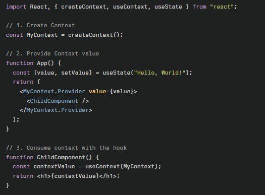

# Context API

The Context API in React Provides a way to share data across components without manually passing props at every level(called prop drilling).

- Props → Used for direct parent-to-child data transfer. Explicit but can get messy if deeply nested.

- Context API → Allows you to create a global state (via `React.createContext`) and make it accessible to any component in the tree using `Provider` and `useContext`.

The React Context API has two main parts.  
1. `Provider` : Provide the data
- It provides the data to all components that need it.
- The Provider defines the global state and share it with child component.
2. `Consumer` : Received the Data
- it comsumes the data provided by the Provider.

---

```useContext Hooks```: The useContext hook in React allows you to access values from a React Context, making it easy to share state or data among multiple components—without needing to pass props down manually through every level (avoiding “prop drilling”)  

### Key Points
1. Purpose: useContext lets components subscribe to context values directly, making shared state management across deeply nested components much easier.  
2. Creation: First, create a context using React.createContext().  
3. Provider: Wrap one or more components with the <YourContext.Provider> to make the context available in their subtree.  
4. Usage: Call const value = useContext(YourContext); inside any functional component to read the value provided by the nearest matching Provider above it in the component tree.

### Basic Example


---

